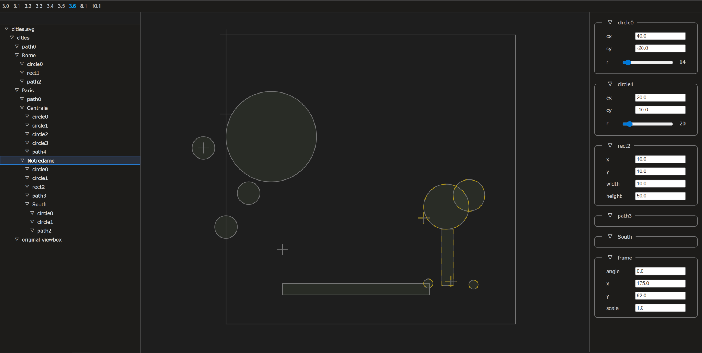

# jscom
A Component Framework in pure Javascript, without using external frameworks.
An approach to proof that it's still possible to write complex UI's withou any
dependencies to external frontend frameworks when extendibility and modularization 
is built into the core from the start. The Component Object Model is my inspiritation
but hopefully without the bloat that came with it.

Encapsulation is crucial for software projects to grow, although hard to achieve
in the Javascript, CSS and HTML domain where everything is open by design.
The goal is that the only way to interact with a component is via interfaces that
the component exposes. This is also true for CSS styles that all live in their own 
Shadow DOM. If one wants to break encapsulation it is not possible to prevent this
completely. But I do my best to make it as hard as possible.

Web framework design is hard because of the complexity of the underlying specs.
My endeavor in this project is a work in progress. To see how far I can come with it.
If I can build a full fledged vector graphics editor with it the proof is done.

Since my view on data is that everything is tree-like the central data structure is a
state tree of properties. These can handle two-way databinding. For external data
which is in general also tree-like (JSON, XML, ...) custom property classes can be 
registered and integrate seamlessly into the built-in property tree. An example of 
this integration can be seen in shared/svg-property.js.

The flexibility of the recursive definition of properties can go as far as 
self-modifying editors. Creating file formats "on the fly" or attaching to already 
instantiated external tree structures like the DOM.

This project here is focused on resizable, editor-oriented UI components for Single 
Page Applications (SPA's) similar to Visual Studio Code that needs to be extended
permanantly as the project at hand grows.

[Early Preview of an SVG editor](https://micage2.github.io/jscom/)

